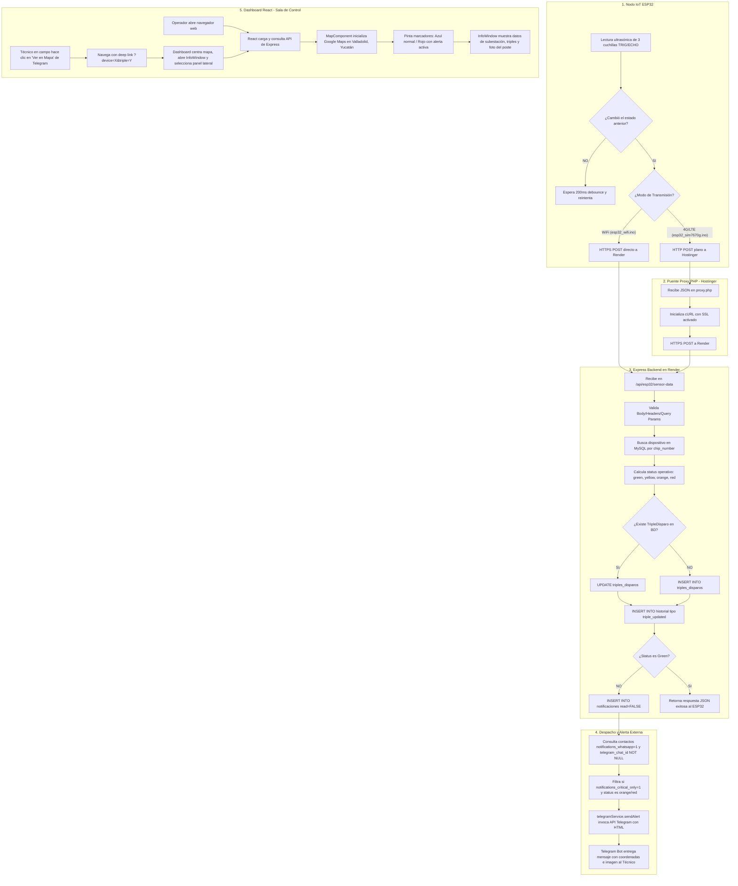
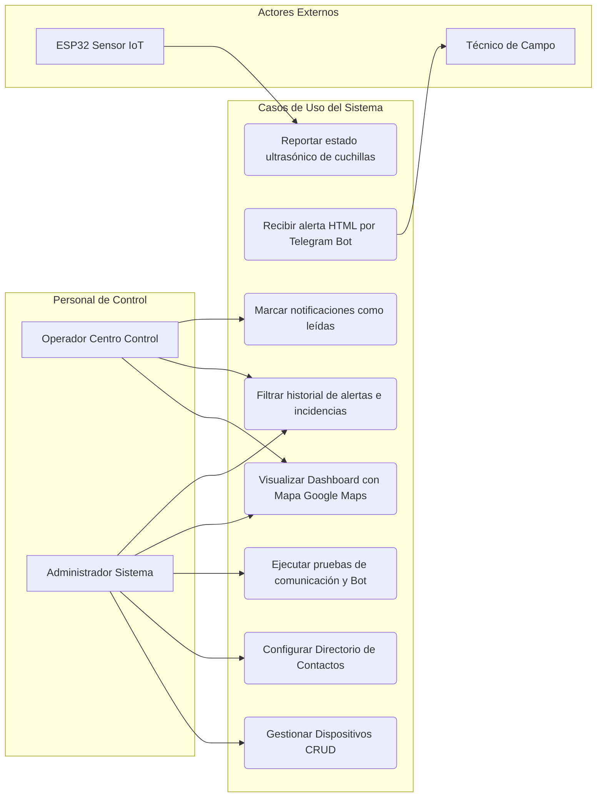
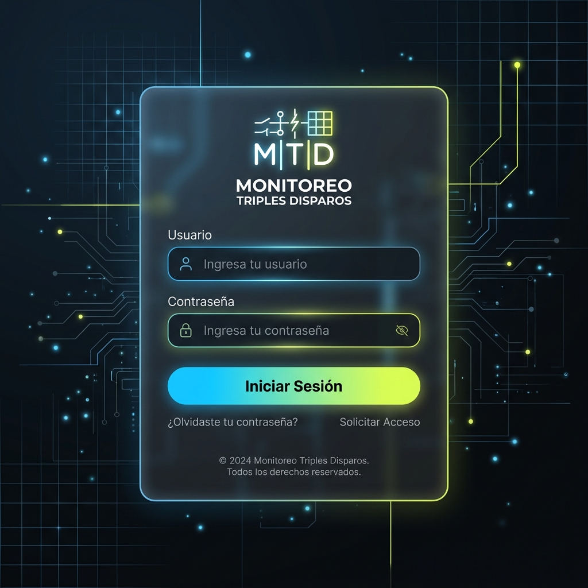
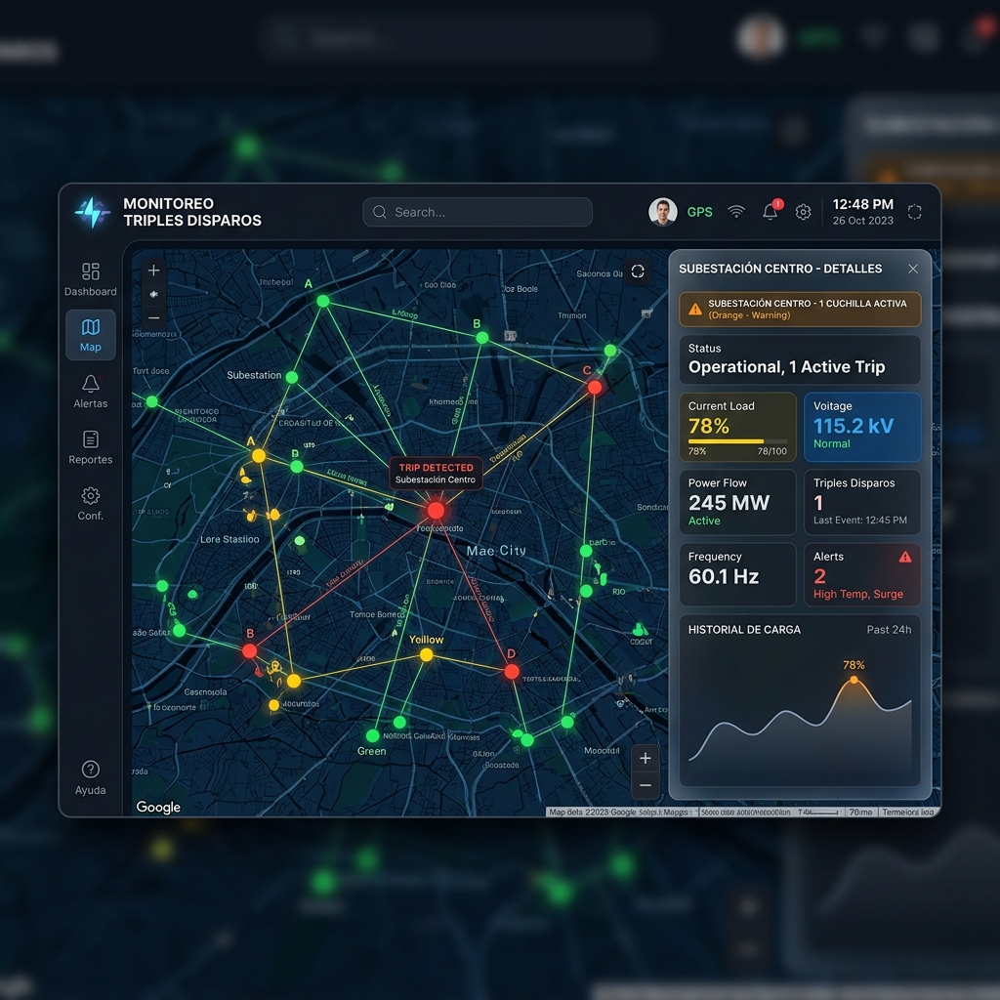
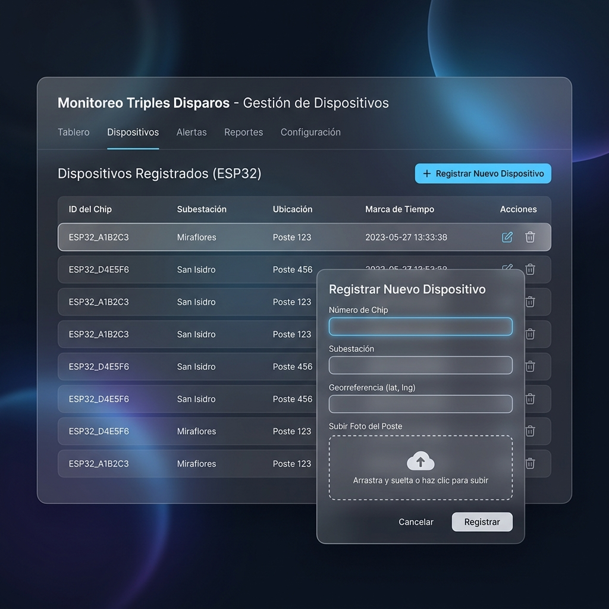
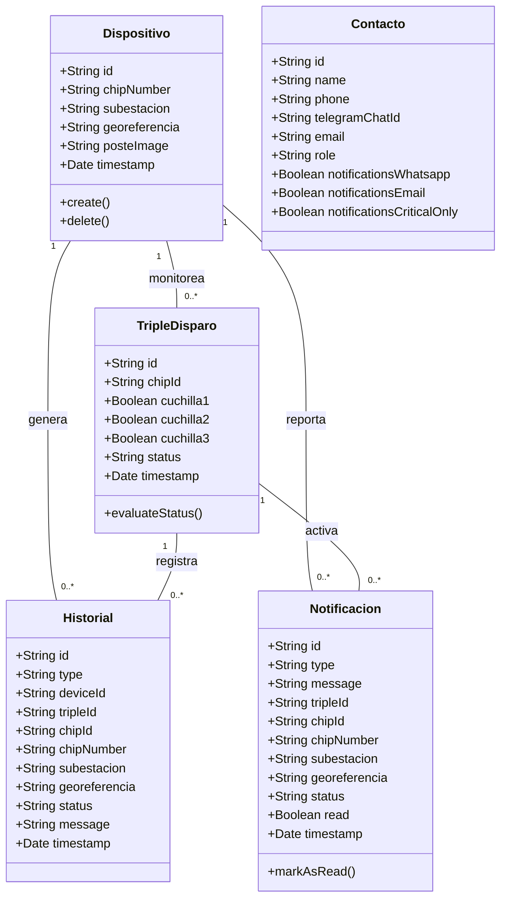
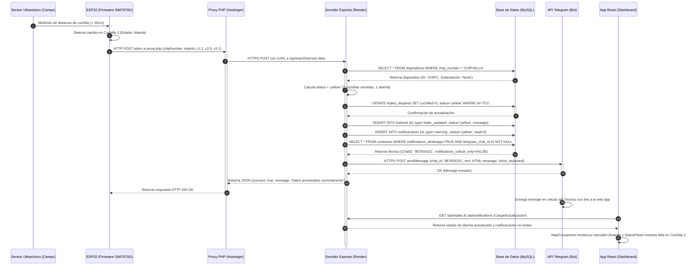

# Documento de Diseño Inicial de Sistema: Monitoreo Triples Disparo

Este documento contiene el diseño de software elaborado para el sistema **Monitoreo Triples Disparo**, diseñado y estructurado a partir del código y la arquitectura del proyecto físico real.

---

## Fase 0: Introducción

### 1. Objetivo
El objetivo de este documento es detallar la arquitectura técnica y el diseño estructural del **Sistema de Monitoreo de Triples Disparos**. Este sistema supervisa de manera automática el estado físico (apertura y cierre) de las cuchillas fusibles de protección en subestaciones y postes de media tensión dentro de la red de distribución eléctrica. La meta principal consiste en automatizar la detección de fallas de fase (disparos parciales o totales de cortacircuitos) y disparar alertas de campo inmediatas para reducir el tiempo acumulado de interrupción del servicio eléctrico.

### 2. Descripción del Problema y Solución
* **El Problema:** Cuando se produce una sobrecarga o una falla transitoria en las líneas de distribución aérea de media tensión, las cuchillas de protección física (fusibles) se abren (se disparan) mecánicamente para resguardar la subestación. Si sólo una o dos fases fallan, la línea sigue energizada parcialmente, causando pérdidas operacionales, interrupciones de suministro asimétricas que dañan los motores de los clientes finales y patrullajes de campo manuales e ineficientes que tardan horas en localizar el punto exacto de la falla.
* **La Solución:** Este sistema integra hardware IoT, servidores backend y visualización web:
  1. **Nodos de Telemetría ESP32 (Campo):** Equipados con tres sensores ultrasónicos montados frente a cada cuchilla para medir la distancia física. Un cambio en la distancia de rebote (> 10 cm) indica que la cuchilla se ha disparado (abierto). El microcontrolador reporta este estado por WiFi o mediante red celular LTE/4G (con un módulo SIM7670G).
  2. **Servidor Central (Backend Express + MySQL):** Recibe las transmisiones de campo, calcula el nivel de severidad del fallo (Verde = Normal, Amarillo = Falla en 1 fase, Naranja = Falla en 2 fases, Rojo = Falla en las 3 fases) e inicia procesos automáticos en base de datos.
  3. **Visualización y Alerta (Frontend React + Servicios SMS):** Dispone de un mapa en tiempo real con Google Maps que ilumina la subestación afectada y envía alertas automáticas via WhatsApp/Telegram a los teléfonos móviles de los técnicos de campo con las coordenadas GPS exactas.

---

## Fase 1: Entender el problema

### 1. Definición de Actores
A continuación se detallan los cuatro actores primordiales que interactúan con el ecosistema de monitoreo:

1. **Sensor IoT ESP32 (Dispositivo de Campo):**
   * *Tipo:* Sistema / Hardware.
   * *Rol:* Monitorea las cuchillas cortacircuito por medio de mediciones de distancia por ultrasonido. Realiza la lectura física e inicia la transmisión de datos enviando peticiones JSON mediante HTTP POST al servidor central cuando detecta fluctuaciones de distancia en los sensores.
2. **Operador de Centro de Control (Despachador):**
   * *Tipo:* Usuario Humano.
   * *Rol:* Supervisa el Dashboard web principal. Consulta el mapa interactivo para localizar subestaciones alarmadas, realiza búsquedas de dispositivos específicos, lee notificaciones entrantes y despacha técnicos al sitio a partir de las coordenadas del sistema.
3. **Técnico de Mantenimiento (Receptor de Alertas):**
   * *Tipo:* Usuario Humano (Receptor).
   * *Rol:* Recibe notificaciones estructuradas en su teléfono celular a través de mensajería (WhatsApp y Telegram) que detallan el nombre de la subestación con fallas, las coordenadas geográficas precisas para navegar mediante GPS y una imagen del poste/caja de control de referencia.
4. **Administrador del Sistema:**
   * *Tipo:* Usuario Humano (Admin).
   * *Rol:* Configura la infraestructura tecnológica del sistema. Administra el alta, baja o edición de dispositivos ESP32, asocia los números de chip a las subestaciones físicas, actualiza el directorio telefónico de técnicos de campo y audita el historial de eventos.

---

### 2. Diagrama de Procesos / Casos de Uso

El sistema se rige bajo procesos de comunicación bien definidos en el código del proyecto. No hay flujos supuestos: la interacción física del hardware, la lógica del servidor de rutas y el despacho final de alertas siguen los siguientes modelos estructurados:

#### A. Diagrama de Procesos del Sistema (Arquitectura de Comunicación Real)
Este diagrama representa el flujo exacto de la información a nivel de red y bases de datos, detallando el puente de conexión por proxy para la telemetría celular y el uso del Bot de Telegram:



#### B. Casos de Uso del Sistema por Actor Mapeados al Código
Mapeo de funcionalidades de firmware, endpoints de Express y vistas de frontend:



---

## Fase 2: Diseñar la solución

### 1. Prototipo de Interfaz de Usuario (Mockups)

El diseño visual se conceptualizó bajo una temática industrial oscura para reducir la fatiga visual en salas de control continuo, aplicando el paradigma de *glassmorphism* (paneles con transparencia simulando cristal translúcido):

#### Boceto 1: Pantalla de Login (Acceso Seguro)
Un panel centralizado que valida el usuario y contraseña del personal técnico. Cuenta con efectos de gradientes de color de alta visibilidad para elementos interactivos.


#### Boceto 2: Dashboard Principal (Mapa y Panel de Control)
Integra el mapa de Google Maps con capas de estilos oscuros y marcadores semafóricos (Azul para normal, Rojo para alertas críticas). Al seleccionar un poste o subestación, el panel lateral derecho muestra los indicadores individuales de las tres cuchillas, estadísticas del sistema y accesos rápidos de mantenimiento.


#### Boceto 3: Gestión de Dispositivos (CRUD)
Una vista administrativa estructurada con tablas de datos dinámicas para listar todos los chips instalados, permitiendo asociar las georreferencias de los postes, nombres de subestaciones y cargar imágenes físicas del lugar.


---

### 2. Diagrama de Clases UML

El modelo conceptual del backend que rige la base de datos relacional y las clases principales del software se representa de la siguiente manera:



**Leyenda del Diagrama de Clases:**
* **Dispositivo:** Representa físicamente el módulo ESP32 asociado a una subestación. Almacena metadatos y la imagen física del poste.
* **TripleDisparo:** Representa la lectura instantánea de las cuchillas cortacircuitos (fases 1, 2 y 3). Mantiene el estatus calculado por la aplicación (`green`, `yellow`, `orange`, `red`).
* **Contacto:** Contiene a los técnicos y supervisores encargados del mantenimiento físico y sus preferencias de notificación de alarmas.
* **Historial / Notificación:** Tablas auxiliares para auditar todas las operaciones de red y emitir alertas inmediatas de pantalla.

---

### 3. Diagrama de Secuencia de un Proceso Clave
El proceso central es el **reporte físico de una falla de fase desde el ESP32 (usando el módulo celular SIM7670G) hasta la notificación de alerta en el móvil del técnico y el dashboard del operador**. El siguiente diagrama detalla la secuencia cronológica exacta de mensajes, reflejando el proxy PHP y la API del bot de Telegram:



---

## Fase 3: Preparar la base de datos

### 1. Modelo de Datos y Diccionario

La base de datos relacional se compone de 5 tablas fundamentales. A continuación se detallan los campos, tipos y restricciones de integridad:

#### Tabla: `dispositivos`
* Guarda los registros base de cada chip ESP32 montado en la red eléctrica.
* **Llave Primaria (`PK`):** `id` (VARCHAR(50)).
* **Campos:**
  * `chip_number` (VARCHAR(50), UNIQUE, NOT NULL): Código único del hardware.
  * `subestacion` (VARCHAR(100), NOT NULL): Nombre de la subestación.
  * `georeferencia` (VARCHAR(100), NOT NULL): Coordenadas Latitud/Longitud (ej: `20.696, -88.189`).
  * `poste_image` (LONGTEXT, NULL): Imagen en base64 de la ubicación física.
  * `timestamp` (TIMESTAMP, DEFAULT CURRENT_TIMESTAMP): Fecha de actualización.

#### Tabla: `triples_disparos`
* Almacena las lecturas en tiempo real de las tres cuchillas de distribución.
* **Llave Primaria (`PK`):** `id` (VARCHAR(50)).
* **Llave Foránea (`FK`):** `chip_id` referenciando a `dispositivos(id)` con política `ON DELETE CASCADE`.
* **Campos:**
  * `cuchilla1`, `cuchilla2`, `cuchilla3` (BOOLEAN, DEFAULT TRUE): Estado individual de cada fase (1 = cerrado, 0 = abierto).
  * `status` (ENUM('green', 'yellow', 'orange', 'red'), NOT NULL): Estado ponderado de la alerta.
  * `timestamp` (TIMESTAMP, DEFAULT CURRENT_TIMESTAMP).

#### Tabla: `contactos`
* Registro de técnicos y personal administrativo que recibe las alertas.
* **Llave Primaria (`PK`):** `id` (VARCHAR(50)).
* **Campos:**
  * `name` (VARCHAR(100), NOT NULL): Nombre del técnico.
  * `phone` (VARCHAR(20), NOT NULL): Número telefónico (WhatsApp).
  * `telegram_chat_id` (VARCHAR(100), NULL): ID único de Telegram de la persona.
  * `role` (VARCHAR(50), NULL): Cargo (ej. Técnico, Supervisor).
  * `notifications_whatsapp` (BOOLEAN, DEFAULT TRUE): Bandera para alertas por WhatsApp.
  * `notifications_critical_only` (BOOLEAN, DEFAULT TRUE): Filtrar alertas leves.

---

### 2. Archivo SQL de Inicialización (DDL)

```sql
-- Estructura de Tablas SQL en MySQL

CREATE TABLE IF NOT EXISTS dispositivos (
    id VARCHAR(50) PRIMARY KEY,
    chip_number VARCHAR(50) UNIQUE NOT NULL,
    subestacion VARCHAR(100) NOT NULL,
    georeferencia VARCHAR(100) NOT NULL,
    poste_image LONGTEXT,
    timestamp TIMESTAMP DEFAULT CURRENT_TIMESTAMP,
    created_at TIMESTAMP DEFAULT CURRENT_TIMESTAMP,
    updated_at TIMESTAMP DEFAULT CURRENT_TIMESTAMP ON UPDATE CURRENT_TIMESTAMP
);

CREATE TABLE IF NOT EXISTS triples_disparos (
    id VARCHAR(50) PRIMARY KEY,
    chip_id VARCHAR(50) NOT NULL,
    cuchilla1 BOOLEAN DEFAULT TRUE,
    cuchilla2 BOOLEAN DEFAULT TRUE,
    cuchilla3 BOOLEAN DEFAULT TRUE,
    status ENUM('green', 'yellow', 'orange', 'red') NOT NULL,
    timestamp TIMESTAMP DEFAULT CURRENT_TIMESTAMP,
    created_at TIMESTAMP DEFAULT CURRENT_TIMESTAMP,
    updated_at TIMESTAMP DEFAULT CURRENT_TIMESTAMP ON UPDATE CURRENT_TIMESTAMP,
    FOREIGN KEY (chip_id) REFERENCES dispositivos(id) ON DELETE CASCADE,
    INDEX idx_chip_id (chip_id),
    INDEX idx_status (status),
    INDEX idx_timestamp (timestamp)
);

CREATE TABLE IF NOT EXISTS contactos (
    id VARCHAR(50) PRIMARY KEY,
    name VARCHAR(100) NOT NULL,
    phone VARCHAR(20) NOT NULL,
    telegram_chat_id VARCHAR(100) DEFAULT NULL,
    email VARCHAR(100),
    role VARCHAR(50),
    notifications_whatsapp BOOLEAN DEFAULT TRUE,
    notifications_email BOOLEAN DEFAULT FALSE,
    notifications_critical_only BOOLEAN DEFAULT TRUE,
    created_at TIMESTAMP DEFAULT CURRENT_TIMESTAMP,
    updated_at TIMESTAMP DEFAULT CURRENT_TIMESTAMP ON UPDATE CURRENT_TIMESTAMP,
    INDEX idx_phone (phone),
    INDEX idx_telegram_chat_id (telegram_chat_id)
);
```

---

## Conclusión

**¿Qué problema se resolvió con este diseño?**
El diseño desarrollado solventa de manera integral la **falta de visibilidad y el retraso en la detección de fallas de fase** en redes eléctricas aéreas. Anteriormente, el operador dependía enteramente de los reportes telefónicos de los clientes afectados cuando una fase se abría (un cortocircuito monofásico fusible), lo que demoraba horas en su localización.

Con este diseño, la apertura física de una cuchilla activa los sensores ultrasónicos y la red IoT del ESP32 de inmediato. El sistema procesa los datos y en menos de un segundo calcula la gravedad del incidente, alerta visualmente al despachador a través de un mapa y envía coordenadas geográficas de Google Maps y una imagen del poste al teléfono del técnico responsable de la zona. Se reducen drásticamente los tiempos de patrullaje y se mejora de forma directa la confiabilidad y calidad del suministro de energía para la población.
